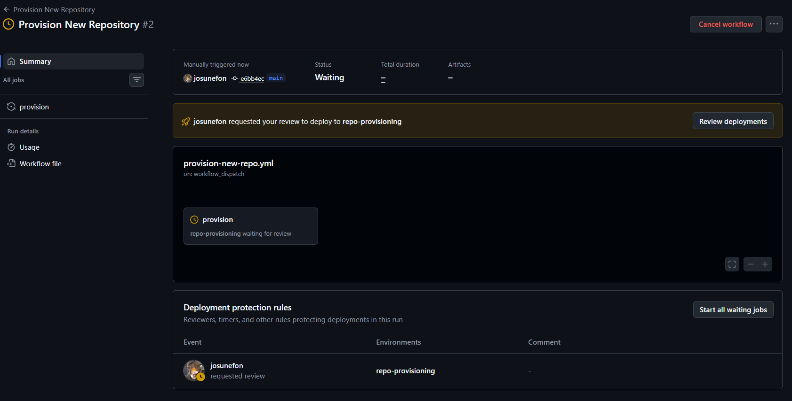
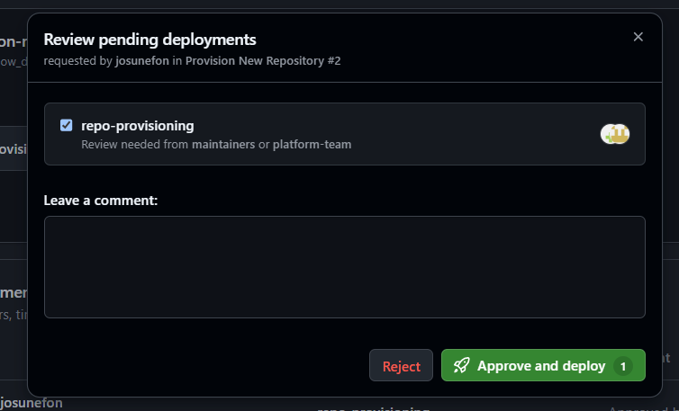

# golden-repo

[](https://github.com/josunefoOrg/golden-repo/actions/workflows/ci.yml)
[](https://github.com/josunefoOrg/golden-repo/blob/main/LICENSE)
[](https://github.com/josunefoOrg/golden-repo/actions/workflows/codeql.yml)
[](https://github.com/josunefoOrg/golden-repo/actions/workflows/secret-scan.yml)

golden-repo is a GitHub template repository for creating secure agent and security-tooling repositories. It provides a reusable baseline for repositories similar to SOCBot and PostureIQ-style projects, with standard directories for `infra/`, `src/`, `docs/`, and `tools/`.

## Quickstart

Create a new repository from this template:

```bash
gh repo create <org>/<name> --template josunefoOrg/golden-repo
```

Clone the generated repository and install the local tooling dependencies:

```bash
git clone https://github.com/<org>/<name>.git
cd <name>
python -m pip install -r tools/requirements.txt
```

Provision the repository baseline:

```bash
GITHUB_TOKEN=<github-app-installation-token> python tools/provision_repo.py --org <org> --repo <name>
```

Use a GitHub App installation token or another approved short-lived token source. Do not use long-lived personal access tokens.

## Architecture

See [docs/architecture.md](docs/architecture.md) for the template architecture, repository layout, provisioning flow, and security baseline.

## Workflows

This template includes GitHub Actions workflows that automate testing, security scanning, supply-chain integrity, and repository provisioning. The status checks `test`, `analyze`, and `gitleaks` are required for merge on protected branches.

- **CI** (`.github/workflows/ci.yml`) - Runs on every pull request and push to `main`. Installs dependencies from `tools/requirements.txt`, runs pytest, and lints. Produces the required `test` status check.

- **CodeQL** (`.github/workflows/codeql.yml`) - Advanced static analysis (SAST). Runs on pull requests, push to `main`, and weekly (Mondays 03:23 UTC). Scans Python and JavaScript/TypeScript code; skips languages absent from the repo. Produces the required `analyze` status check. Note: this template uses advanced CodeQL configuration; do not enable CodeQL "default setup" in the UI as it conflicts.

- **Secret Scan** (`.github/workflows/secret-scan.yml`) - Runs Gitleaks on pull requests and push to `main`, scanning full git history. Produces the required `gitleaks` status check. Complements GitHub-native secret scanning and push protection (enabled by the provisioner).

- **SBOM and Signing** (`.github/workflows/sbom-signing.yml`) - SLSA L3-aligned supply-chain workflow. Triggered on release publication, tag push matching `v*`, or manual dispatch. Generates Syft SPDX SBOMs, signs them keylessly with Cosign using OIDC, and pairs release artifacts with SLSA provenance.

- **Framework Compliance Review** (`.github/workflows/framework-compliance-review.yml`) - Runs on pull requests (opened, reopened, synchronized, ready_for_review). Invokes the `framework-compliance-reviewer` Copilot custom agent to review the repo against the AI Agent Risk Management framework and posts the review as a PR comment, adding a `compliance reviewed` label. Skips PRs already carrying the label (remove it to force re-review). Requires an organization-level Actions secret `COPILOT_CLI_TOKEN` (a fine-grained personal access token from a Copilot-enabled account; classic PATs are not supported by the Copilot CLI). Consumes Copilot usage quota.

- **Provision New Repository** (`.github/workflows/provision-new-repo.yml`) - Self-service workflow for creating and securing new repositories from this template. Triggered via manual dispatch (`workflow_dispatch`), gated behind the `repo-provisioning` environment approval. IMPORTANT: This workflow exists only in golden-repo and is the provisioning tool itself; it is removed from every generated repository and does not run inside provisioned repos.

- **Dependabot** (`.github/dependabot.yml`) - Configuration (not a workflow file). Schedules weekly version updates for GitHub Actions and pip dependencies (`/tools`), grouped and labeled `dependencies`. Uncommented entries update Actions and tools; additional ecosystems (npm, docker) are commented out and can be enabled once their manifest files exist.

## Provisioning a new repo

New repositories are provisioned through:

- `tools/provision_repo.py` - command-line provisioning for repository settings, security features, branch protection, and team access.
- `.github/workflows/provision-new-repo.yml` - self-service GitHub Actions workflow for creating and securing repositories from this template.

The provisioning flow is expected to enable Dependabot alerts and security updates, secret scanning, secret scanning push protection, CodeQL default setup, and the branch protection baseline below.

## Required environment configuration

The self-service workflow `.github/workflows/provision-new-repo.yml` uses `environment: repo-provisioning` as a manual approval gate before privileged repository provisioning runs. Provisioning is therefore not fully unattended.

IMPORTANT: Create the GitHub Environment and its required reviewers manually in the GitHub UI. Environment protection rules and required reviewers CANNOT be created via API/script and must be configured manually before provisioning is treated as ready.

Create the environment in the repository that hosts the workflow:

1. Open repository or organization settings for `josunefoOrg/golden-repo`.
2. Go to `Settings` -> `Environments`.
3. Select `New environment`.
4. Name it `repo-provisioning`.
5. Enable `Required reviewers`.
6. Add the approver team or users, preferably `maintainers` or `platform-team`.
7. Save the protection rules.

The workflow also needs these organization-level Actions credentials from the provisioning GitHub App:

- Variable: `PROVISIONER_APP_ID`
- Secret: `PROVISIONER_APP_PRIVATE_KEY`

Set them with `gh`:

```bash
gh variable set PROVISIONER_APP_ID --org josunefoOrg --body "<app-id>"
gh secret set PROVISIONER_APP_PRIVATE_KEY --org josunefoOrg < path/to/private-key.pem
```

Visibility flags may be required by org policy, for example `--visibility all` or selected repository access. See [docs/SETUP.md](docs/SETUP.md) for the full one-time GitHub App registration and installation steps.

### Approving a provisioning run

When the self-service workflow is dispatched, the provision job pauses at the `repo-provisioning` environment and requests reviewer approval. An authorized reviewer (member of `maintainers` or `platform-team`) opens the workflow run, clicks "Review deployments", and approves the deployment to release the provisioning job.



*The provision job is paused and requesting review to deploy to repo-provisioning.*

The approval dialog appears with the environment name, required reviewer team, and options to reject or approve the deployment:



*The reviewer approves the deployment to release the provisioning job.*

## Branch protection baseline

The `main` branch must use this baseline:

- Pull request reviews require at least 1 approval.
- Stale approvals are dismissed when new commits are pushed.
- Code Owner review is required.
- Required status checks are strict and must be up to date before merge.
- Required status check contexts are exactly `test`, `build`, `analyze`, and `gitleaks`.
- Signed commits are required.
- Force-push is disabled.
- Branch deletion is disabled.
- Branch protection is enforced for administrators.
- Push access is restricted to the `maintainers` team.

### Known limitation: plan tier

Branch protection on private repositories requires a paid GitHub plan (Team or Enterprise). On the Free plan, GitHub returns HTTP 403 ("Upgrade to GitHub Pro or make this repository public") and the branch-protection step fails. This is a GitHub platform limitation, not a provisioner defect. The provisioner applies the baseline correctly on paid-plan organizations and fails loud by design if the plan does not support it. All other provisioning steps (repo creation, admin team, placeholder README, description, topics) work on any plan. If you are testing on the Free plan, expect the branch-protection step to fail; provision into a paid-plan org or a public repo to exercise it.

## Repository layout

```text
infra/           Infrastructure definitions and deployment assets.
src/             Application and agent source code.
docs/            Architecture, operations, and security documentation.
tests/           Test suite; runs in CI via pytest (the required `test` status check).
tools/           Provisioning and repository automation scripts.
.github/agents/  Optional Copilot custom agents shipped with generated repos.
```

## Optional Copilot agents

This template can ship reusable Copilot custom agents under `.github/agents/` so every repository generated from it starts with domain expertise built in. Agents are Markdown files with a YAML front matter header (`name`, `description`, `tools`, `model`) followed by the agent instructions.

Recommended agents to support new agent/security-tooling projects:

- **IaC agent** - reviews and authors infrastructure-as-code in `infra/` (Bicep/Terraform), enforces tagging, network, and least-privilege conventions.
- **Security agent** - reviews changes for security issues, validates the security baseline (secret scanning, CodeQL, signed commits), and flags risky patterns.
- **AI Risk & Security Advisor** (`.github/agents/risk-security-advisor.md`) - included in this template. Advises on risk tier classification, Zero Trust architecture, threat detection, incident response, and compliance for enterprise AI agents on Microsoft Foundry.
- **Framework Compliance Reviewer** (`.github/agents/framework-compliance-reviewer.md`) - included in this template. Reviews repository content and configuration against the AI Agent Risk Management framework (Zero Trust, RBAC, guardrails, data protection, supply chain security, risk tiering, and mandatory controls) and reports compliance gaps with evidence-based remediation. The review rubric is embedded in the agent, so it works standalone in any generated repo. An automated PR review workflow (`.github/workflows/framework-compliance-review.yml`) runs this agent on each pull request and labels the PR `compliance reviewed` when done, skipping PRs already carrying that label. The workflow requires an organization-level Actions secret named `COPILOT_CLI_TOKEN` (a fine-grained personal access token from a Copilot-enabled account; classic PATs are not supported by the Copilot CLI) to authenticate the GitHub Copilot CLI.

To add another agent, drop a new `.github/agents/<name>.md` file following the same front matter format. To remove one, delete its file. Agents are inert until invoked, so they add no runtime cost to a generated repo.

## License

This template is distributed under the MIT License. The license holder and license choice are template defaults and can be replaced for generated repositories when needed.
