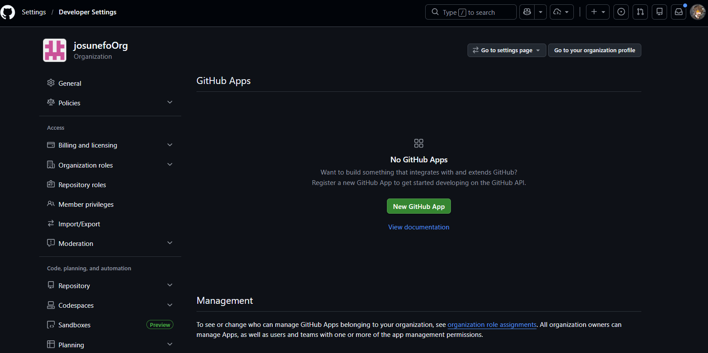
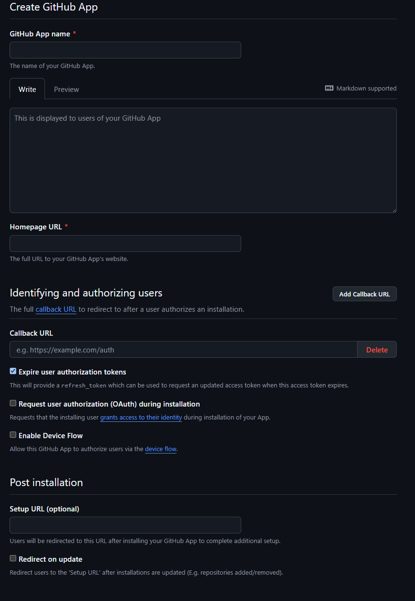
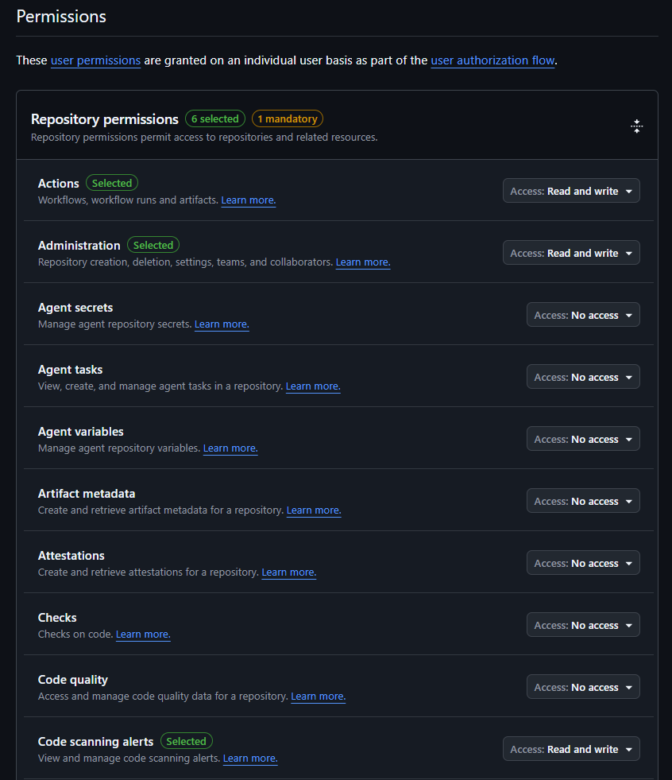
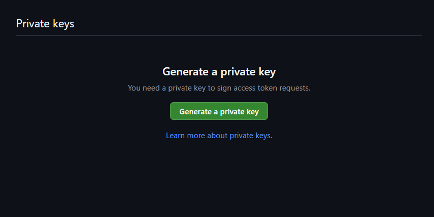
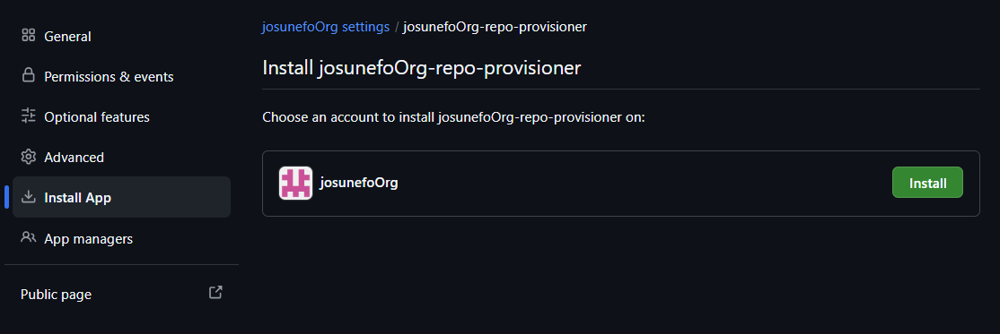
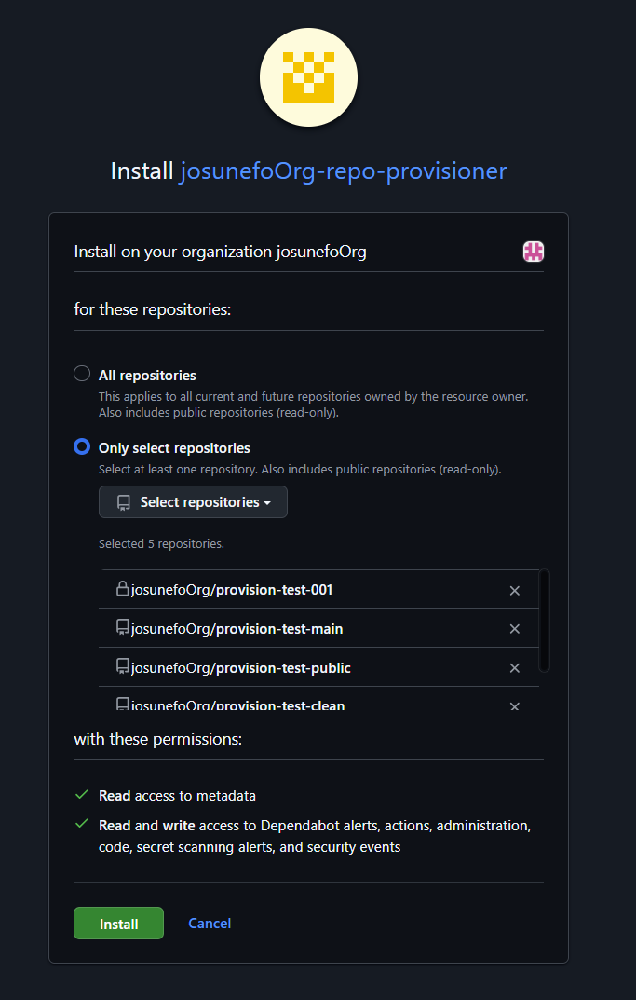
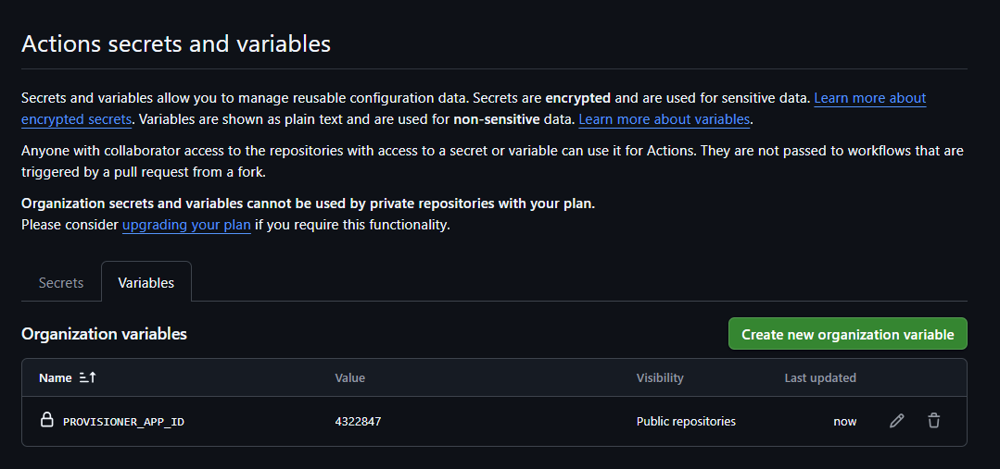
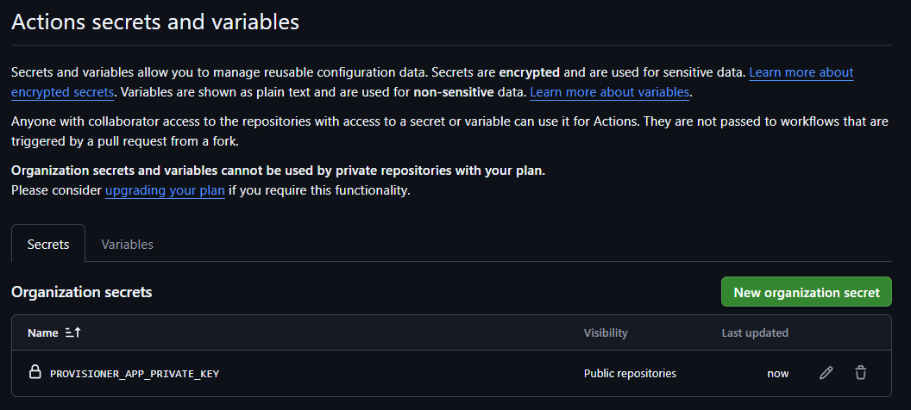
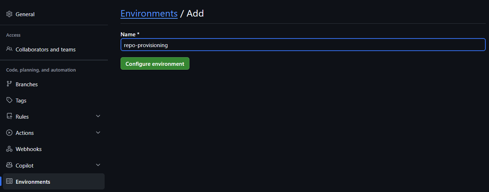

# MANUAL ONE-TIME SETUP

These steps cannot be fully scripted because they create trust anchors, install an org-level GitHub App, define approval gates, and enable organization security features.

Complete these steps before using self-service repository provisioning.

Target organization: `josunefoOrg`

Platform: GitHub.com

## 1. Register the org-level GitHub App

MANUAL ONE-TIME STEP.

UI path:

1. Open `https://github.com/organizations/josunefoOrg/settings/apps`.
2. Select `New GitHub App`.

   

   *GitHub Apps settings page with the New GitHub App button.*

3. Set GitHub App name, for example `josunefoOrg-repo-provisioner`.
4. Set Homepage URL to `https://github.com/josunefoOrg/golden-repo`.
5. Webhook:
   - Clear `Active`.
   - No webhook subscriptions are needed.

   

   *Create GitHub App form showing required fields.*

6. Set repository permissions:
   - Administration: Read and write.
   - Contents: Read and write.
   - Metadata: Read-only.
   - Actions: Read and write.
   - Code scanning alerts: Read and write.
   - Secret scanning alerts: Read and write.
   - Dependabot alerts: Read and write.
7. Set organization permissions:
   - Members: Read and write. (Read and write is required so provisioning can create the per-repo admin team; read-only causes a 403 on team creation.)
8. Subscribe to no webhooks.
9. Select `Create GitHub App`.
10. Record the App ID.

Required permissions summary:

```text
Repository Administration: Read and write
Contents: Read and write
Metadata: Read-only
Actions: Read and write
Code scanning alerts: Read and write
Secret scanning alerts: Read and write
Dependabot alerts: Read and write
Members: Read and write
Webhooks: none
```



*Repository permissions configuration showing required Actions and Administration access.*

## 2. Generate and download the private key

MANUAL ONE-TIME STEP. This private key is a trust anchor.

UI path:

1. Open `https://github.com/organizations/josunefoOrg/settings/apps`.
2. Select the provisioner App.
3. Open `General`.
4. Under `Private keys`, select `Generate a private key`.

   

   *Private keys section showing the Generate a private key button.*

5. Save the downloaded `.pem` file locally.
6. Do not commit the private key.
7. Delete local copies after storing the key as an org Actions secret.

## 3. Install the App on `josunefoOrg`

MANUAL ONE-TIME STEP.

UI path:

1. Open the App settings page.
2. Select `Install App`.
3. Select `josunefoOrg`.

   

   *Install App page showing josunefoOrg as the target account.*

4. Choose one:
   - `All repositories` for centralized provisioning across the org.
   - `Only select repositories` if the App should operate only on approved repos.

   

   *Repository selection and permissions summary during app installation.*

5. Select `Install`.

Least-privilege default: choose selected repositories unless the platform team has approved org-wide provisioning.

## 4. Store Actions variable and secret

MANUAL ONE-TIME STEP. Use org-level storage so the platform workflow can mint App installation tokens.

### UI steps

1. Open `https://github.com/organizations/josunefoOrg/settings/secrets/actions`.
2. Under `Variables`, create:
   - Name: `PROVISIONER_APP_ID`
   - Value: the GitHub App ID.

   

   *Organization variables tab with PROVISIONER_APP_ID variable.*

3. Under `Secrets`, create:
   - Name: `PROVISIONER_APP_PRIVATE_KEY`
   - Value: the full downloaded private key contents, including the BEGIN and END lines.

   

   *Organization secrets tab with PROVISIONER_APP_PRIVATE_KEY secret.*

### `gh` alternative

Run from the directory containing the downloaded `.pem` file:

```powershell
$appId = "REPLACE_WITH_APP_ID"
$privateKeyPath = ".\REPLACE_WITH_PRIVATE_KEY_FILE.pem"

gh variable set PROVISIONER_APP_ID `
  --org josunefoOrg `
  --body $appId

gh secret set PROVISIONER_APP_PRIVATE_KEY `
  --org josunefoOrg `
  --visibility all `
  --body (Get-Content -Raw $privateKeyPath)
```

Delete the local private key after verifying the secret was stored:

```powershell
Remove-Item -Path $privateKeyPath
```

## 5. Create the `repo-provisioning` GitHub Environment

MANUAL ONE-TIME STEP. This is the approval gate before privileged repository provisioning.

### UI steps

1. Open `https://github.com/josunefoOrg/golden-repo/settings/environments`.
2. Select `New environment`.
3. Name it `repo-provisioning`.

   

   *Create new GitHub Environment with the name repo-provisioning.*

4. Select `Configure environment`.
5. Enable `Required reviewers`.
6. Add the approved reviewer team or users. Prefer a team, for example `maintainers` or `platform-team`.
7. Save protection rules.

### `gh` alternative

This example uses the `maintainers` team as the required reviewer team:

```powershell
$org = "josunefoOrg"
$repo = "golden-repo"
$environment = "repo-provisioning"
$reviewerTeamSlug = "maintainers"
$reviewerTeamId = gh api "/orgs/$org/teams/$reviewerTeamSlug" --jq ".id"

gh api `
  -X PUT `
  -H "Accept: application/vnd.github+json" `
  -H "X-GitHub-Api-Version: 2022-11-28" `
  "/repos/$org/$repo/environments/$environment" `
  -F "reviewers[][type]=Team" `
  -F "reviewers[][id]=$reviewerTeamId" `
  -F "deployment_branch_policy[protected_branches]=true" `
  -F "deployment_branch_policy[custom_branch_policies]=false"
```

## 6. Create reviewer and access teams

MANUAL ONE-TIME STEP. Access must be team-based.

Required team slugs:

- `infra-team`
- `dev-team`
- `platform-team`
- `maintainers`

### UI steps

1. Open `https://github.com/orgs/josunefoOrg/teams`.
2. Select `New team`.
3. Create each required team.
4. Use visible or closed privacy according to org policy.
5. Add users to teams based on role.
6. Do not grant standing individual admin access as a substitute for team permissions.

### `gh` alternative

```powershell
$org = "josunefoOrg"
$teams = @("infra-team", "dev-team", "platform-team", "maintainers")

foreach ($team in $teams) {
  $exists = gh api "/orgs/$org/teams/$team" 2>$null
  if ($LASTEXITCODE -ne 0) {
    gh api `
      -X POST `
      -H "Accept: application/vnd.github+json" `
      -H "X-GitHub-Api-Version: 2022-11-28" `
      "/orgs/$org/teams" `
      -f "name=$team" `
      -f "privacy=closed"
  }
}
```

## 7. Mark `golden-repo` as a template repository

MANUAL ONE-TIME STEP.

### UI steps

1. Open `https://github.com/josunefoOrg/golden-repo/settings`.
2. Under `Template repository`, check `Template repository`.
3. Save changes if prompted.

### `gh` alternative

```powershell
gh api `
  -X PATCH `
  -H "Accept: application/vnd.github+json" `
  -H "X-GitHub-Api-Version: 2022-11-28" `
  "/repos/josunefoOrg/golden-repo" `
  -f is_template=true
```

## 8. Enable GitHub Advanced Security where required

MANUAL ONE-TIME STEP. Private repositories need GitHub Advanced Security for some features, including CodeQL code scanning and secret scanning capabilities, depending on license and plan.

### Org UI

1. Open `https://github.com/organizations/josunefoOrg/settings/security_analysis`.
2. Enable GitHub Advanced Security according to license availability.
3. Enable or allow:
   - Dependency graph.
   - Dependabot alerts.
   - Dependabot security updates.
   - Code scanning.
   - Secret scanning.
   - Secret scanning push protection.

### Repository UI

1. Open `https://github.com/josunefoOrg/golden-repo/settings/security_analysis`.
2. Enable available security features for the template repository.
3. Repeat for target private repositories if org-level defaults do not apply.

### `gh` examples

Enable repository security and analysis features where supported:

```powershell
$org = "josunefoOrg"
$repo = "golden-repo"

gh api `
  -X PATCH `
  -H "Accept: application/vnd.github+json" `
  -H "X-GitHub-Api-Version: 2022-11-28" `
  "/repos/$org/$repo" `
  -f "security_and_analysis[advanced_security][status]=enabled" `
  -f "security_and_analysis[secret_scanning][status]=enabled" `
  -f "security_and_analysis[secret_scanning_push_protection][status]=enabled"
```

Enable CodeQL default setup where the endpoint and license support it:

```powershell
$org = "josunefoOrg"
$repo = "golden-repo"

gh api `
  -X PATCH `
  -H "Accept: application/vnd.github+json" `
  -H "X-GitHub-Api-Version: 2022-11-28" `
  "/repos/$org/$repo/code-scanning/default-setup" `
  -f state=configured `
  -f query_suite=default
```

If these commands fail with a license or endpoint error, enable the feature in the UI and verify the org has GitHub Advanced Security for private repositories.

## 9. Enable the framework compliance review workflow (optional)

OPTIONAL STEP. This workflow runs the framework-compliance-reviewer Copilot agent on each pull request to review repository content and configuration against the AI Agent Risk Management framework, posts the compliance report as a PR comment, and adds a `compliance reviewed` label so the same PR is not re-reviewed. The workflow is included in every provisioned repo and inherited from the template. To enable it to run, store the GitHub Copilot CLI authentication token as an Actions secret named `COPILOT_CLI_TOKEN`.

Prerequisite: a GitHub Copilot seat or subscription for the account whose token is used. The workflow runs the GitHub Copilot CLI headlessly, which requires authentication.

### Recommended: Store the secret at organization level

Set the secret once at the organization level (Settings > Secrets and variables > Actions > New organization secret) and every provisioned repo will inherit it. This avoids per-repo setup.

Create a fine-grained personal access token (PAT) from a Copilot-enabled account. It MUST be a fine-grained token (prefix `github_pat_`). Classic PATs (prefix `ghp_`) are NOT supported by the Copilot CLI and fail with "Classic Personal Access Tokens (ghp_) are not supported by Copilot." The token needs minimal scope: it only authenticates Copilot and does not require repo write access because the workflow uses the built-in `GITHUB_TOKEN` for PR comments and labels.

Store the secret at the organization level with visibility applied to all repos or selected repos:

```bash
gh secret set COPILOT_CLI_TOKEN --org <org> --visibility all
```

Or to scope the secret to specific repositories:

```bash
gh secret set COPILOT_CLI_TOKEN --org <org> --visibility selected --repos <repo1>,<repo2>
```

Paste or pipe the token when prompted.

### Alternative: Store the secret at repository level

For a single repository, store the secret at the repository level:

```bash
gh secret set COPILOT_CLI_TOKEN -R <owner>/<repo>
```

### Notes

- The workflow consumes GitHub Copilot usage for each PR review.
- The workflow runs once per PR (guarded by the `compliance reviewed` label) unless the label is removed, which forces a re-review.

## GHES differences

- Some GHES versions expose different endpoints for CodeQL default setup, secret scanning, and push protection.
- GitHub Advanced Security is required for private repository code scanning and secret scanning features on GHES.
- OIDC works on GHES, but the token issuer URL differs from GitHub.com and must be configured in the relying service trust policy.
- API version support can lag GitHub.com. Check the GHES version-specific REST API documentation before copying GitHub.com endpoints.
- GitHub App installation and private key handling are the same security model, but UI paths may differ.
