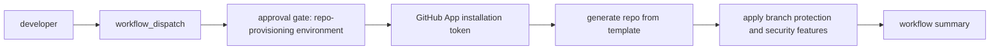

# golden-repo architecture

golden-repo is the central template and provisioning control point for `josunefoOrg`. It combines:

1. Template repository contents: reusable baseline files, CI/security workflows, CODEOWNERS, docs, `infra/`, and `src/`.
2. `tools/provision_repo.py`: the idempotent provisioning tool that creates or updates a generated repository using a GitHub App installation token from `GITHUB_TOKEN`.
3. `.github/workflows/provision-new-repo.yml`: the self-service entry point that collects inputs, waits for approval, obtains an App token, runs the provisioning tool, and publishes a summary.

## Provisioning flow



ASCII equivalent:

```text
developer
  |
  v
workflow_dispatch
  |
  v
approval gate: repo-provisioning environment
  |
  v
GitHub App installation token
  |
  v
generate repository from josunefoOrg/golden-repo template
  |
  v
apply branch protection + security features
  |
  v
summary
```

## Component responsibilities

### 1. Template repository contents

The template repository is `josunefoOrg/golden-repo`. New repositories inherit the baseline project skeleton and governance assets from this repo:

- `src/` for application source placeholders.
- `infra/` for infrastructure-as-code placeholders.
- `tests/` for the test suite; the CI `test` job runs `pytest` here and is a required status check.
- `docs/` for architecture, setup, branch-protection, and operational docs.
- `.github/` for workflows, CODEOWNERS, issue configuration, and security automation.
- `.github/agents/` for optional Copilot custom agents (for example the included `risk-security-advisor`, plus optional IaC and security agents) that ship with generated repos.
- Standard CI/security check names:
  - `test`
  - `build`
  - `analyze`
  - `gitleaks`
  - `sbom` for release/tag SBOM generation and signing.

### 2. `tools/provision_repo.py`

The provisioning tool is the imperative enforcement layer. It should be safe to rerun and should converge the target repository toward the baseline instead of relying on one-time manual drift-prone steps.

Expected responsibilities:

- Generate the target repository from `josunefoOrg/golden-repo`.
- Apply the authoritative `main` branch-protection baseline.
- Enable repository security features:
  - Dependabot alerts.
  - Dependabot security updates.
  - Secret scanning.
  - Secret scanning push protection.
  - CodeQL default setup where supported.
- Apply team-based access from workflow/script inputs.
- Use only the token in `GITHUB_TOKEN`; never read or require a standing PAT.

### 3. Self-service provisioning workflow

`.github/workflows/provision-new-repo.yml` is the controlled user interface for repository creation.

Expected flow:

- A developer starts `workflow_dispatch` and supplies repository inputs.
- The job targets the `repo-provisioning` GitHub Environment.
- Environment required reviewers provide the manual approval gate.
- The workflow exchanges the stored GitHub App credentials for a short-lived installation token.
- The token is exposed to the provisioning tool as `GITHUB_TOKEN`.
- The tool generates the repo and applies controls.
- The workflow writes a human-readable summary.

## Security model

The provisioning model is least-privilege and token-minimized:

- No standing PATs. Personal access tokens are not part of the design.
- GitHub App installation tokens are short-lived and scoped to the installed org/repositories and declared App permissions.
- `PROVISIONER_APP_ID` is an org Actions variable.
- `PROVISIONER_APP_PRIVATE_KEY` is an org Actions secret.
- The approval gate is enforced by the `repo-provisioning` GitHub Environment before privileged provisioning runs.
- Access is team-based, not individual-admin based.
- Push access to protected `main` is restricted to the `maintainers` team.
- OIDC is the preferred model for cloud and signing federation. Workflows should request only the minimum required permissions, such as `id-token: write` only in jobs that need keyless signing or cloud federation.

## Branch-protection and security baseline

The protected branch is `main`.

Required controls:

- At least one pull request approval.
- Code Owner review required.
- Stale approvals dismissed when new commits are pushed.
- Required checks must be strict and up to date:
  - `test`
  - `build`
  - `analyze`
  - `gitleaks`
- Signed commits required.
- Force pushes disabled.
- Branch deletion disabled.
- Admins included.
- Push restricted to the `maintainers` team.

## SLSA L3 SBOM and signing alignment

The release/tag SBOM path is aligned with SLSA L3 principles by using automated CI, explicit workflow permissions, ephemeral credentials, and keyless signing:

- SBOM generation uses Syft.
- Signing uses Cosign keyless signing with GitHub Actions OIDC.
- The `sbom` job is release/tag-triggered and produces signed supply-chain metadata.
- OIDC avoids long-lived signing keys in repository or org secrets.
- Build and release provenance should remain generated by trusted automation, not developer workstations.

This baseline is an alignment target for generated repositories. Any repository with higher assurance requirements should document additional controls such as hardened runners, artifact attestations, deployment environment isolation, and release approval policies.
